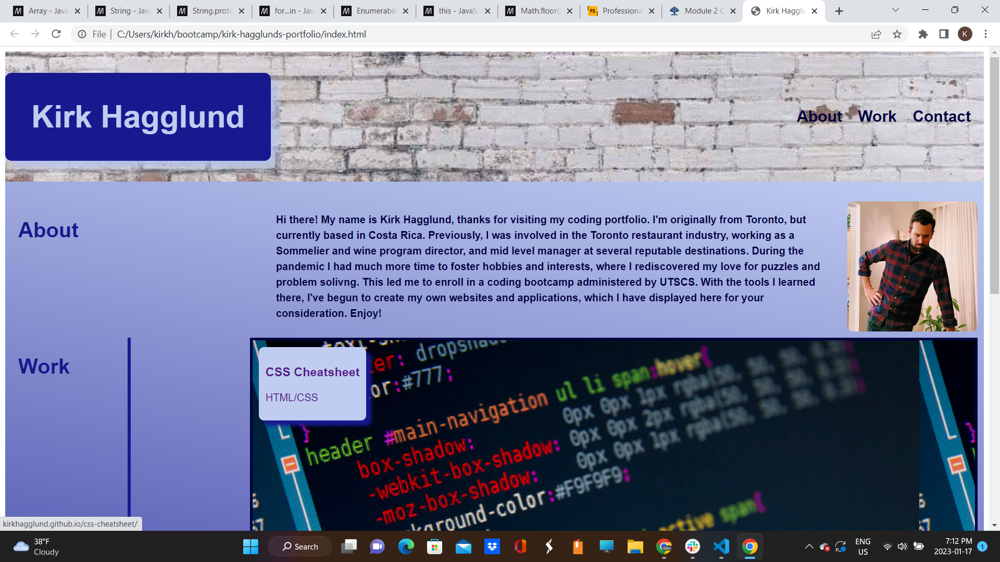

# Kirk Hagglund's Portfolio

## Description

In this repository you will find a link to my professional coding portfolio. 

I wanted to create a reference page to provide the public, notably potential employers or professional collaborators with a convenient way to explore my past projects.

As I progress in my coding career, this repository will be regularly updated to include a recent and accurate reflection of my knowledge and abilities.

I was able to put my current knowledge of CSS, notably Flexbox and Grid layouts to use in creating this repository, and improved on my initial level of comfort with those tools.

## Usage

In the 'Work' section of the webpage, click on any of the panels to follow a link to the aforementioned projects. 

Website URL: http://kirkhagglund.github.io/kirk-hagglunds-portfolio/

'''md

'''

## Credits

This project would not have been possible without the assistance of several support staff members with Ask BCS Learning Assistant. Additionally, MDN Web Docs had two guides that were of particular use.

Grid Layout Guide: https://developer.mozilla.org/en-US/docs/Web/CSS/CSS_Grid_Layout/Basic_Concepts_of_Grid_Layout

Flexbox Guide: https://developer.mozilla.org/en-US/docs/Learn/CSS/CSS_layout/Flexbox

## License

MIT License Copyright (c) 2023 KirkHagglund